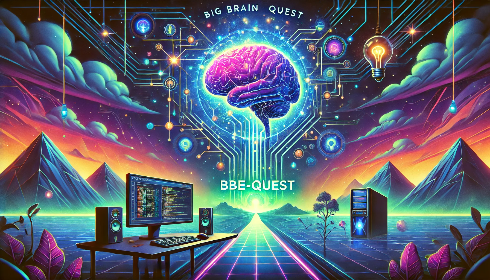

# BBE-Quest: Big Brain Energy Quest

[](https://codecov.io/gh/Brains-Beyond-Expectations/bbe-quest)



BBE-Quest is a CLI tool (`bbe`) that automates the end-to-end setup and ongoing management of a home-lab Kubernetes cluster running on [Talos Linux](https://www.talos.dev/). It handles everything from flashing node images to installing a full media and networking stack — the goal is a *set-and-forget* home lab cluster.

Supported hardware: **Intel NUC** (x86) and **Raspberry Pi 4** (ARM64). Mixed clusters are supported.

## Quick Start

```bash
curl -fsSL https://raw.githubusercontent.com/Brains-Beyond-Expectations/bbe-quest/main/install.sh | bash
bbe config   # initialise configuration
bbe setup    # provision your first node
bbe install  # install media and networking packages
```

## Documentation

- [Getting Started](docs/getting-started.md) — prerequisites, installation, first-time setup walkthrough
- [Architecture](docs/architecture.md) — how BBE-Quest works internally, service overview
- [Configuration](docs/configuration.md) — `bbe.yaml` schema, local vs. AWS S3 storage
- [Supported Hardware](docs/hardware.md) — Intel NUC and Raspberry Pi 4 details
- [Troubleshooting](docs/troubleshooting.md) — common errors and how to fix them

### Commands

- [`bbe setup`](docs/commands/setup.md) — provision a new node and bootstrap or join a cluster
- [`bbe install`](docs/commands/install.md) — install Helm package bundles on the cluster
- [`bbe upgrade`](docs/commands/upgrade.md) — upgrade installed packages to latest versions
- [`bbe config`](docs/commands/config.md) — initialise or sync the `bbe.yaml` configuration
- [`bbe version`](docs/commands/version.md) — print the current CLI version

### Contributing

- [Local Development](docs/development.md) — build, test, and extend BBE-Quest

## Related

- [bbe-charts](https://github.com/Brains-Beyond-Expectations/bbe-charts) — the Helm chart repository powering `bbe install` and `bbe upgrade`
