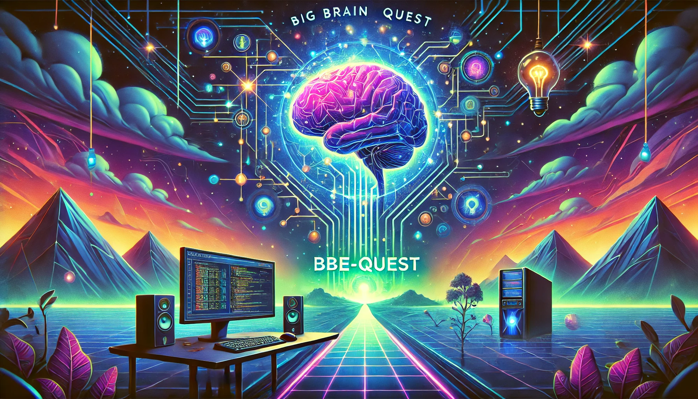

# BBE-Quest: Big Brain Energy Quest

## Welcome to BBE-Quest

BBE-Quest (Big Brain Energy Quest) is your ultimate guide to building and
automating a home lab Kubernetes (k8s) cluster. This project offers a fully
guided and automated journey, taking the complexity out of the process and
making it accessible even for those new to the world of home labs.

### Project Objective

Our goal is to provide:

- **Streamlined Home Lab Automation**: Automate the setup and management of your
  Kubernetes cluster with minimal manual intervention.
- **Guided Learning Journey**: Each step is designed to teach and empower you,
  turning complex tasks into achievable milestones.
- **Collaborative Excellence**: Crafted by two passionate nerds who love to
  share knowledge and solve challenges together.

---

### Key Features

- End-to-end scripts for deploying and managing a k8s cluster.
- Documentation and guidance for understanding each phase of the process.
- Tools and tips for monitoring, scaling, and maintaining your setup.

### Getting Started

> [!NOTE]  
> Since Talos does not support secure boot on x86, you will need to disable
> secure boot in the BIOS settings of x86 devices.

### Local Development

## Requirements

- [Docker](https://docs.docker.com/get-docker/)
- [crane](https://github.com/google/go-containerregistry/blob/main/cmd/crane/README.md)
- [balenaEtcher](https://www.balena.io/etcher/)
- [talosctl](https://www.talos.dev/v1.8/learn-more/talosctl/)
- [nmap](https://nmap.org/)
- [yq](https://mikefarah.gitbook.io/yq/)

## Development Roadmap

- Guide through dependency setup, check for deps and ask to install (support
  brew, curl, wget, etc)
- Check for exsting config on SSM. If it doesn't exist try to create the initial
  scaffolding (optional to use AWS or local file)
- If no config exists anywhere ask for the user to provide the necessary
  information
  - Ask for units in fleet (arm64, amd64, etc. Use human readable names)
  - Is it the first time running this tool 😳
  - If it is the first time, generate the config (ask for cluster-name)
- Check for existing ISOs and ask if we should regenerate (based on arch)
- Ask user to insert USB drive and flash the ISO
- Ask user to boot from USB
- Ask the user to confirm they did the thing
- Poll ips to look for the new node (nmap), check the disk (talosctl disks) and
  change default if it is not sda (the default) and apply the config
- Bootstrap the cluster
- Provide the user with the ip of the new node and ask them to persist it
  (potentially research how to do this nicely)
- Make sure we have ip of control plane in config
- Suggest K9s and provide how to set it up

Research:

- Look into disk encryption in talos machine config
- Figure out what is different for RPi

CLI:

- Create BBE CLI

CI/CD ideas:

- Simply YAML to define tools (possibly use Helmfile to read it)

Default tools:

- ArgoCD (possible with domain config)
